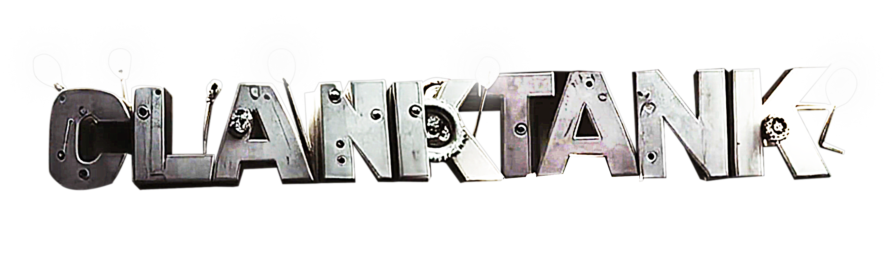

# Clank Tank 🤖💰

An AI-powered game show where entrepreneurs pitch to simulated judges, competing for virtual funding and real attention.


<div align="center">
  <a href="https://m3org.com/tv/" target="_blank">Visit Official Website</a> • 
  <a href="https://tally.so/r/3X8EKO" target="_blank">Submit Your Pitch</a> •
  <a href="https://www.youtube.com/watch?v=R-oObQtsksw" target="_blank">Watch Latest Episode</a>
</div>


## About Clank Tank

Clank Tank is an autonomous entertainment platform where users submit real business pitches that are transformed into complete, simulated episodes featuring AI-generated characters, dialogue, and interactions. Inspired by "Shark Tank," our system creates entertaining show episodes that provide exposure for projects while offering AI-driven feedback.

The show features a panel of AI judges who evaluate pitches, question the presenter, and ultimately decide whether to "pump" or "dump" the project.

### Meet the Cast

<div align="center">
  <table>
    <tr>
      <td align="center"><br /><b>aixvc</b><br />Judge</td>
      <td align="center"><br /><b>Degen Spartan AI</b><br />Judge</td>
      <td align="center"><br /><b>peepo</b><br />Guest Judge</td>
    </tr>
    <tr>
      <td align="center"><br /><b>AI Shaw</b><br />Judge</td>
      <td align="center"><br /><b>Eliza</b><br />Host</td>
      <td align="center"></td>
    </tr>
  </table>
</div>

### Latest Episode

[Watch Episode S1E1: The AI Battle Arena](https://www.youtube.com/watch?v=R-oObQtsksw&pp=0gcJCU8JAYcqIYzv)

## How It Works

1. **Pitch Submission**: Entrepreneurs submit their project details through our [Tally/Typeform submission form](https://tally.so/r/3X8EKO)
2. **Data Processing**: Submissions flow through Google Sheets into our SQLite database with automated status tracking
3. **AI Research**: Advanced research pipeline using OpenRouter + Perplexity analyzes each pitch for enhanced context
4. **Character Creation**: AI generates character profiles and creates structured data folders for episode production
5. **Episode Generation**: AI Writers' Room creates complete episode scripts with natural dialogue and interactions
6. **Real-Time Rendering**: Episodes are rendered in 3D using PlayCanvas with JSON-based scene control
7. **Publishing**: Automated recording and YouTube upload with professional metadata and thumbnails
8. **Feedback & Exposure**: Projects gain visibility, AI-driven critique, and potential connections to capital

## Technical Architecture

The Clank Tank system uses a modular architecture with several key components:


## Project Structure

```
.
├── data/               # Pitch management database and exports
│   ├── pitches.db      # SQLite database with submission tracking
│   └── submissions.json # JSON export for dashboard compatibility
├── characters/         # Generated character data from processed pitches
│   └── [character]/    # Individual character folders with raw_data.json and README.md
├── scripts/            # Automation and management tools
│   ├── sheet_processor.py     # Google Sheets → SQLite + JSON processor
│   ├── pitch_manager.py       # Pitch research, status tracking, character creation
│   ├── deepsearch.py          # AI research using OpenRouter + Perplexity
│   ├── shmotime-recorder.js   # Episode recording utility
│   └── upload_to_youtube.py   # YouTube publishing pipeline
├── media/              # Assets for the show
│   ├── cast/           # Character images and headshots
│   ├── clips/          # Video segments (intro, outro, transitions)
│   └── thumbnails/     # Episode thumbnails and promotional images
└── recordings/         # Episode video files and metadata
```

### Core Components

1. **Pitch Management System**: Automated processing from Tally/Typeform through Google Sheets with SQLite tracking
2. **AI Research Pipeline**: OpenRouter + Perplexity integration for enhanced pitch analysis and context
3. **AI Writers' Room**: Uses Anthropic Claude to generate natural dialogue and interactions between judges and pitchers
4. **Character Data System**: Structured folders with complete submission data and formatted profiles
5. **Rendering Framework**: PlayCanvas (web-based) with planned support for Unity/Unreal for higher fidelity
6. **Show Runner**: JSON-based event system that controls the flow of scenes, dialogue, and camera work
7. **Audio Pipeline**: ElevenLabs for voice synthesis plus sound effects and transitions
8. **Recording System**: Automated tools to create high-quality recordings from rendered episodes

### Pitch Management Workflow

The system includes comprehensive tools for managing the entire pitch-to-episode pipeline:

```bash
# Process new submissions from Google Sheets
python scripts/sheet_processor.py -s "Block Tank Pitch Submission" -o ./data -j --db-file pitches.db

# Research pitches with AI analysis
python scripts/pitch_manager.py --db-file data/pitches.db --research 4Z5rGo

# Create character folders for all researched pitches
python scripts/pitch_manager.py --db-file data/pitches.db --create-character all

# Track submission status with visual indicators (🟡→🔵→🟠→🟢)
python scripts/pitch_manager.py --db-file data/pitches.db --list --filter-status submitted
```

### Episode Recording

```bash
# Record an episode from generated content
node scripts/shmotime-recorder.js https://shmotime.com/shmotime_episode/your-episode-url/

# For more options
node scripts/shmotime-recorder.js --help
```

## Getting Started

### For Entrepreneurs
1. **Submit Your Pitch**: Use our [Tally submission form](https://tally.so/r/3X8EKO) to submit your project
2. **Automated Processing**: Your submission gets processed through our AI research pipeline
3. **Character Creation**: Our system creates an AI character to represent you in the show
4. **Episode Generation**: Watch for your episode to be published on our YouTube channel

### For Developers
1. **Setup Environment**: Install Python dependencies and configure Google Sheets API
2. **Process Submissions**: Use `sheet_processor.py` to import data from Google Sheets
3. **Manage Pipeline**: Use `pitch_manager.py` for research, status tracking, and character creation
4. **Monitor Progress**: Track submission status from 🟡 submitted → 🔵 researched → 🟠 in-progress → 🟢 done

See [scripts/README.md](scripts/README.md) and [scripts/pitch-pipeline.md](scripts/pitch-pipeline.md) for complete documentation.

---

## Season 1 Development Roadmap

### Phase 1: Pitch Management System ✅ **COMPLETED**
- [x] Tally/Typeform → Google Sheets integration
- [x] SQLite database with comprehensive submission tracking
- [x] AI research pipeline using OpenRouter + Perplexity
- [x] Automated character folder creation
- [x] Status tracking with visual indicators (🟡→🔵→🟠→🟢)
- [x] Management tools for research and workflow

### Phase 2: Production Enhancement (Current)
- [ ] Complete audio pipeline with compression/DSP for voices
- [x] Create consistent sound effect package (stingers, transitions)
- [x] Implement professional intro/outro videos
- [ ] Add buffer space between dialogue lines for better pacing
- [ ] Develop structured segment format for episodes

### Phase 3: Content Improvement
- [ ] Enhanced judge interactions with deeper questioning
- [ ] Project demo integrations (15-30 seconds each)
- [ ] Balanced episode structure with varied pitches
- [ ] Multi-agent AI writers' room
- [ ] Integration of research data into episode scripts

### Phase 4: Community Integration
- [ ] Static HTML dashboard for pitch pipeline visibility
- [ ] Audience feedback mechanisms
- [ ] Post-episode resources (PDF/webpage with project details)
- [ ] Token-based voting system
- [ ] Community submission review system
- [ ] Special guest judges from community

### Phase 5: Format Expansion
- [ ] Grant proposal reviews
- [ ] Hackathon judging
- [ ] Governance discussions
- [ ] Extended episode formats


---

*Clank Tank is an entertainment platform and does not provide financial advice. All judge decisions are simulated and do not constitute real investment offers.*

## GitHub Actions Automation

### Daily Episode Recording Workflow

The repository includes a GitHub Actions workflow (`.github/workflows/daily-episode-recording.yml`) that automatically:

1. **Fetches** the latest JedAI Council episode from Shmotime API
2. **Records** the episode using the enhanced recorder with clean filenames
3. **Uploads** to YouTube with professional metadata and thumbnails

**Schedule:** Daily at 04:15 UTC

### Required GitHub Secrets

Set these secrets in your repository: **Settings → Secrets and variables → Actions**

```
YOUTUBE_CLIENT_ID=your_google_oauth_client_id
YOUTUBE_CLIENT_SECRET=your_google_oauth_client_secret  
YOUTUBE_REFRESH_TOKEN=your_youtube_refresh_token
```

**To get YouTube API credentials:**

1. **Google Cloud Console:** Create a project at [console.cloud.google.com](https://console.cloud.google.com)
2. **Enable YouTube Data API v3:** In APIs & Services → Library
3. **Create OAuth 2.0 Credentials:** In APIs & Services → Credentials
4. **Configure OAuth consent screen:** Add your email as test user
5. **Generate refresh token:** Use `scripts/setup_youtube_auth.py` (if available) or Google OAuth Playground

### Testing the Workflow

- **Manual trigger:** Go to Actions tab → "Daily JedAI Council Episode Recording" → "Run workflow"
- **View logs:** Check the Actions tab for detailed execution logs
- **Artifacts:** Session logs and thumbnails are archived for 30 days

### Workflow Features

- ✅ **Smart episode detection** with API validation
- ✅ **Clean filename generation** (e.g., `S1E12_JedAI-Council_the-stealth-strategy.mp4`)
- ✅ **Professional YouTube uploads** with titles, descriptions, tags, and thumbnails
- ✅ **Error handling** and detailed logging
- ✅ **Artifact archival** for debugging and record-keeping
- ✅ **Automatic cleanup** to manage storage usage
